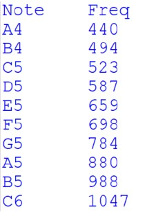
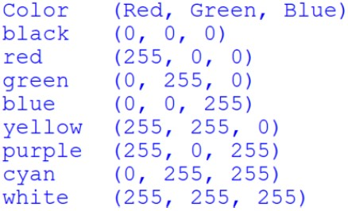
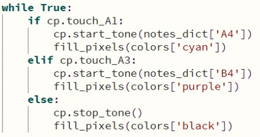

# CPX-Lights-and-Sound

### Introduction
This lab uses dictionaries to hold information about musical notes and colors. It also provides
continued practice with using functions and the capacitive touch pads.

### Procedure
- Create two global dictionaries
  - One to create a key:value pair for music notes and their fundamental frequency
  - Another to pair colors and their RGB tuple value
  - You may use your own values or the suggested values in the following tables
  - Notice there are more colors and notes than you will need
  - 
  - 
- Use an if/elif/else statement to evaluate four of the touch sensors around the board
  - For example, the sample code used A1 and A3. A4 and A6 would be next
  - When a pad is touched it should emit a note and turn on all the pixels
    - The note and color is up to you
  - See the sample below:
    - Notice that you’ll need to include two more touch pads
    - cp.start_tone(<frequency>) is used to make the sound
    - cp.stop_tone() stops the sound
    - fill_pixels(<color>) is a function created to make all the pixels the same color with the color passed as a tuple from the colors dictionary
    - 
- Your code should include the following:
  - The dictionaries as described above
  - A function to turn on all the pixels using a the color tuple as a parameter
  - An if/elif/else structure to evaluate the state of at least four touch pads
  - Each touchpad should have its own tone and color
- Check out this [video](https://www.youtube.com/watch?v=kajOw2PYIA8) for an example

### Turn-in
- Add code.py to your repo and push it.
- Upload a short video demonstrating the flashing lights (If remote)

### Grading
- Proper use of comments
- The two specified dictionaries
- A function that turns on all the pixels as described
- The if/elif/else statement with required actions
- Video demonstrating working project
